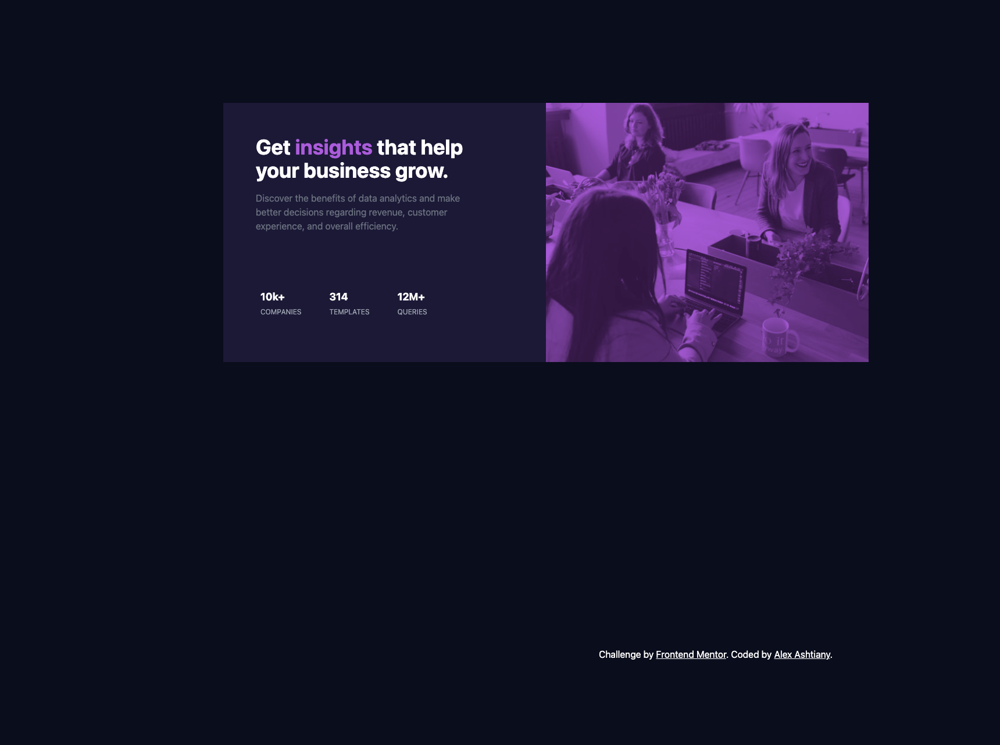
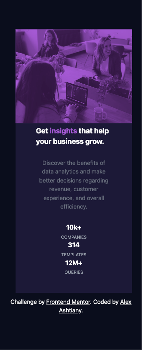

## Table of contents

- [Overview](#overview)
  - [The challenge](#the-challenge)
  - [Screenshot](#screenshot)
  - [Links](#links)
- [My process](#my-process)
  - [Built with](#built-with)
  - [Useful resources](#useful-resources)
- [Author](#author)
- [Acknowledgments](#acknowledgments)

## Overview

### The challenge

Users should be able to:

- View the optimal layout depending on their device's screen size
- See hover states for interactive elements

### Screenshot

### Links

- Solution URL: [Front End Mentor Solution Link](https://www.frontendmentor.io/solutions/order-summary-tailwind-css-7spEtSBDFh)
- Live Site URL: [Netlify Live Website](https://fancy-gelato-986fa7.netlify.app/)

## My process

### Built with

- Semantic HTML5 markup
- CSS custom properties
- Flexbox
- CSS Grid
- Mobile-first workflow

### Useful resources

- [w3schools](https://www.w3schools.com)
- [Tailwind CSS](https://tailwindcss.com)
- [Tailwind UI](https://tailwindui.com)

## Author

- Github - [Alex Ashtiany](https://github.com/AlexDevOp4)
- Frontend Mentor - [@AlexDevOp4](https://www.frontendmentor.io/profile/AlexDevOp4)
